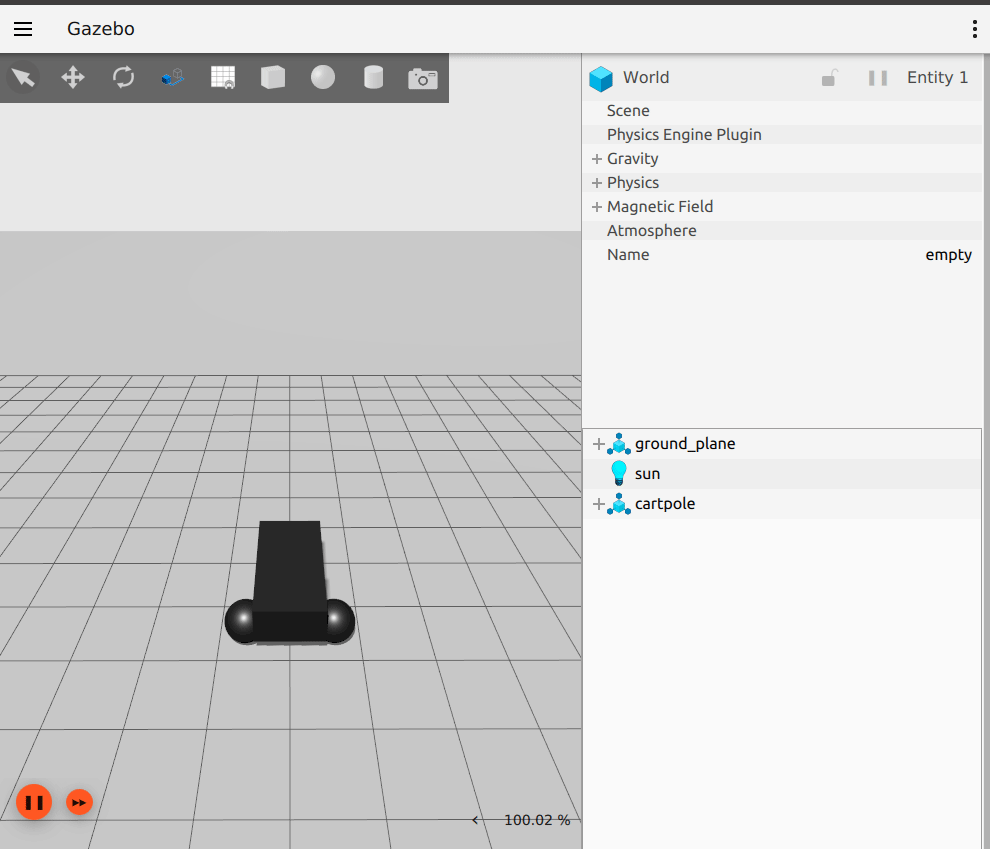

# ign_ros2_control

ROS2 Distro | Build Status | Package build |
:---------: | :----: | :----------: |
[](https://opensource.org/licenses/Apache-2.0) |  [](http://build.ros2.org/job/Gdev__ign_ros2_control__ubuntu_focal_amd64) |  [](http://build.ros2.org/job/Gbin_uF64__ign_ros2_control__ubuntu_focal_amd64__binary) |

This is a ROS 2 package for integrating the `ros2_control` controller architecture with the [Ignition Gazebo](http://ignitionrobotics.org/) simulator.
More information about `ros2_control` can be found here: https://control.ros.org/

This package provides an Ignition Gazebo system plugin which instantiates a `ros2_control` controller manager and connects it to a Gazebo model.

[](https://github.com/ros-controls/gz_ros2_control/actions/workflows/ci.yaml)

ROS version | Ignition version | Branch | Binaries hosted at
-- | -- | -- | --
Foxy | Citadel | [foxy](https://github.com/ros-controls/gz_ros2_control/tree/foxy) | https://packages.ros.org
Foxy | Edifice | [foxy](https://github.com/ros-controls/gz_ros2_control/tree/foxy) | only from source
Galactic | Edifice | [galactic](https://github.com/ros-controls/gz_ros2_control/tree/galactic) | https://packages.ros.org
Galactic | Fortress | [galactic](https://github.com/ros-controls/gz_ros2_control/tree/galactic) | only from source
Humble | Fortress | [ros2](https://github.com/ros-controls/gz_ros2_control/tree/master) | https://packages.ros.org
Rolling | Edifice | [ros2](https://github.com/ros-controls/gz_ros2_control/tree/master) | only from source
Rolling | Fortress | [ros2](https://github.com/ros-controls/gz_ros2_control/tree/master) | https://packages.ros.org
Rolling | Garden (not released) | [ros2](https://github.com/ros-controls/gz_ros2_control/tree/master) | only from source


# Compile from source

If you want compile this from source, you should choose the Ignition version. The default one is `citadel`:

```bash
export IGNITION_VERSION=citadel
export IGNITION_VERSION=edifice
export IGNITION_VERSION=fortress
```

Then create a workspace, clone the repo and compile it:

```bash
mkdir -p ~/ros_ign/src
cd ~/ros_ign/src
git clone https://github.com/ros-controls/gz_ros2_control
rosdep install -r --from-paths . --ignore-src --rosdistro $ROS_DISTRO -y
cd ~/ros2_ign
colcon build
```

# Usage

## Video + Pictures





## Running

### Modifying or building your own

```bash
cd Dockerfile
docker build -t ign_ros2_control .
```

### To run the demo

#### Using Docker

Docker allows us to run the demo without the GUI if configured properly. The following command runs the demo without the GUI:

```bash
docker run -it --rm --name ignition_ros2_control_demo --net host ign_ros2_control ros2 launch ign_ros2_control_demos cart_example_position.launch.py gui:=false
```

Then on your local machine, you can run the Gazebo client:

```bash
ign gazebo -g
```

#### Using Rocker

To run the demo with the GUI, we are going to use [rocker](https://github.com/osrf/rocker/), which is a tool to run docker
images with customized local support injected for things like nvidia support. Rocker also supports user id specific files for cleaner
mounting file permissions. You can install this tool with the following [instructions](https://github.com/osrf/rocker/#installation) (make sure you meet all of the [prerequisites](https://github.com/osrf/rocker/#prerequisites)).

The following command will launch Ignition:

```bash
rocker --x11 --nvidia --name ignition_ros2_control_demo ign_ros2_control:latest
```

The following commands allow the cart to be moved along the rail:

```bash
docker exec -it ignition_ros2_control_demo bash
source /home/ros2_ws/install/setup.bash
ros2 run ign_ros2_control_demos example_position
```

## Add ros2_control tag to a URDF

To use `ros2_control` with your robot, you need to add some additional elements to your URDF.
You should include the tag `<ros2_control>` to access and control the robot interfaces. We should
include:

 - a specific `<plugin>` for our robot
 - `<joint>` tag including the robot controllers: commands and states.

```xml
<ros2_control name="IgnitionSystem" type="system">
  <hardware>
    <plugin>ign_ros2_control/IgnitionSystem</plugin>
  </hardware>
  <joint name="slider_to_cart">
    <command_interface name="effort">
      <param name="min">-1000</param>
      <param name="max">1000</param>
    </command_interface>
    <state_interface name="position">
      <param name="initial_value">1.0</param>
    </state_interface>
    <state_interface name="velocity"/>
    <state_interface name="effort"/>
  </joint>
</ros2_control>
```


### Using mimic joints in simulation

To use `mimic` joints in `ign_ros2_control` you should define its parameters to your URDF.
We should include:

- `<mimic>` tag to the mimicked joint ([detailed manual(https://wiki.ros.org/urdf/XML/joint))
- `mimic` and `multiplier` parameters to joint definition in `<ros2_control>` tag

```xml
<joint name="left_finger_joint" type="prismatic">
  <mimic joint="right_finger_joint"/>
  <axis xyz="0 1 0"/>
  <origin xyz="0.0 0.48 1" rpy="0.0 0.0 3.1415926535"/>
  <parent link="base"/>
  <child link="finger_left"/>
  <limit effort="1000.0" lower="0" upper="0.38" velocity="10"/>
</joint>
```

```xml
<joint name="left_finger_joint">
  <param name="mimic">right_finger_joint</param>
  <param name="multiplier">1</param>
  <command_interface name="position"/>
  <state_interface name="position"/>
  <state_interface name="velocity"/>
  <state_interface name="effort"/>
</joint>
```


## Add the ign_ros2_control plugin

In addition to the `ros2_control` tags, a Gazebo plugin needs to be added to your URDF that
actually parses the `ros2_control` tags and loads the appropriate hardware interfaces and
controller manager. By default the `ign_ros2_control` plugin is very simple, though it is also
extensible via an additional plugin architecture to allow power users to create their own custom
robot hardware interfaces between `ros2_control` and Gazebo.

```xml
<gazebo>
    <plugin filename="libign_ros2_control-system.so" name="ign_ros2_control::IgnitionROS2ControlPlugin">
      <robot_param>robot_description</robot_param>
      <robot_param_node>robot_state_publisher</robot_param_node>
      <parameters>$(find ign_ros2_control_demos)/config/cartpole_controller.yaml</parameters>
    </plugin>
</gazebo>
```

The `ign_ros2_control` `<plugin>` tag also has the following optional child elements:

 - `<parameters>`: YAML file with the configuration of the controllers

#### Default ign_ros2_control Behavior

By default, without a `<plugin>` tag, `ign_ros2_control` will attempt to get all of the information it needs to interface with a ros2_control-based controller out of the URDF. This is sufficient for most cases, and good for at least getting started.

The default behavior provides the following ros2_control interfaces:

 - hardware_interface::JointStateInterface
 - hardware_interface::EffortJointInterface
 - hardware_interface::VelocityJointInterface

#### Advanced: custom ign_ros2_control Simulation Plugins

The `ign_ros2_control` Gazebo plugin also provides a pluginlib-based interface to implement custom interfaces between Gazebo and `ros2_control` for simulating more complex mechanisms (nonlinear springs, linkages, etc).

These plugins must inherit the `ign_ros2_control::IgnitionSystemInterface`, which implements a simulated `ros2_control`
`hardware_interface::SystemInterface`. SystemInterface provides API-level access to read and command joint properties.

The respective IgnitionSystemInterface sub-class is specified in a URDF model and is loaded when the
robot model is loaded. For example, the following XML will load the default plugin:
```xml
<ros2_control name="IgnitionSystem" type="system">
  <hardware>
    <plugin>ign_ros2_control/IgnitionSystem</plugin>
  </hardware>
  ...
<ros2_control>
<gazebo>
  <plugin name="ign_ros2_control::IgnitionROS2ControlPlugin" filename="libign_ros2_control-system.so">
    ...
  </plugin>
</gazebo>
```

#### Set up controllers

Use the tag `<parameters>` inside `<plugin>` to set the YAML file with the controller configuration
and use the tag `<controller_manager_prefix_node_name>` to set the controller manager node name.

```xml
<gazebo>
  <plugin name="ign_ros2_control::IgnitionROS2ControlPlugin" filename="libign_ros2_control-system.so">
    <parameters>$(find ign_ros2_control_demos)/config/cartpole_controller.yaml</parameters>
    <controller_manager_prefix_node_name>controller_manager</controller_manager_prefix_node_name>
  </plugin>
<gazebo>
```

This controller publishes the state of all resources registered to a
`hardware_interface::StateInterface` to a topic of type `sensor_msgs/msg/JointState`.
The following is a basic configuration of the controller.

```yaml
joint_state_controller:
  ros__parameters:
    type: joint_state_controller/JointStateController
```

This controller creates an action called `/cart_pole_controller/follow_joint_trajectory` of type `control_msgs::action::FollowJointTrajectory`.

```yaml
cart_pole_controller:
  ros__parameters:
    type: joint_trajectory_controller/JointTrajectoryController
    joints:
       - slider_to_cart
    write_op_modes:
       - slider_to_cart
```
#### Executing the examples

There are some examples in the `ign_ros2_control_demos` package. These examples allow to launch a cart in a 30 meter rail.

You can run some of the example configurations by running the following commands:

```bash
ros2 launch ign_ros2_control_demos cart_example_position.launch.py
ros2 launch ign_ros2_control_demos cart_example_velocity.launch.py
ros2 launch ign_ros2_control_demos cart_example_effort.launch.py
ros2 launch ign_ros2_control_demos diff_drive_example.launch.py
ros2 launch ign_ros2_control_demos tricycle_drive_example.launch.py
```

Send example commands:

When the Gazebo world is launched, you can run some of the following commands to move the cart.

```bash
ros2 run ign_ros2_control_demos example_position
ros2 run ign_ros2_control_demos example_velocity
ros2 run ign_ros2_control_demos example_effort
ros2 run ign_ros2_control_demos example_diff_drive
ros2 run ign_ros2_control_demos example_tricycle_drive
```

The following example shows parallel gripper with mimic joint:


```bash
ros2 launch ign_ros2_control_demos gripper_mimic_joint_example.launch.py
```

Send example commands:

```bash
ros2 run ign_ros2_control_demos example_gripper
```
